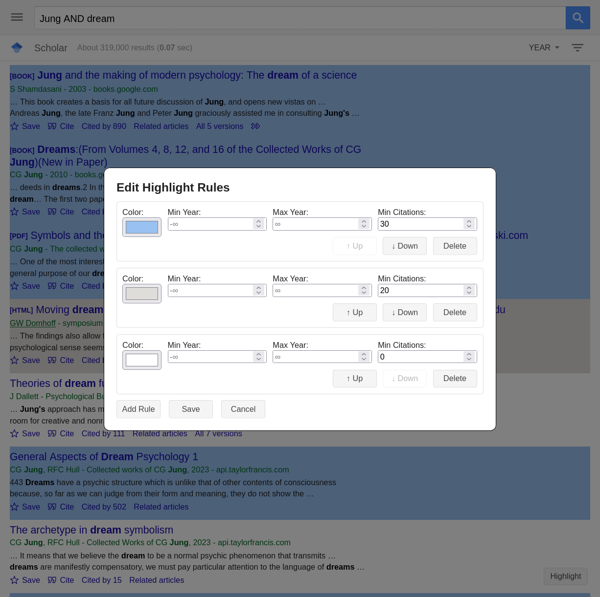
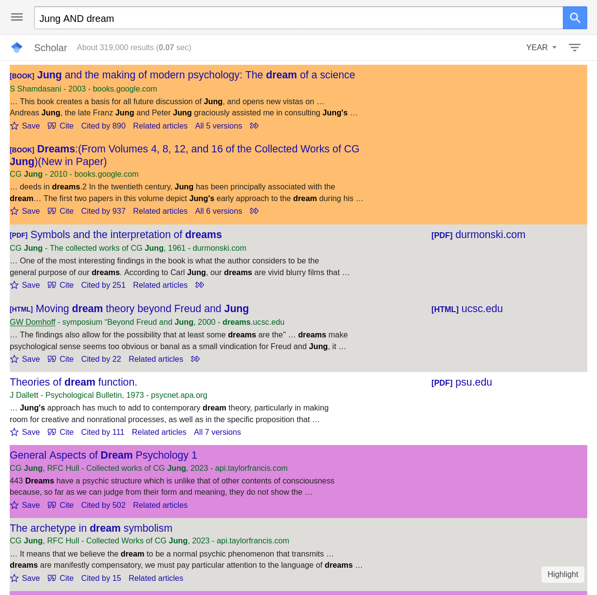
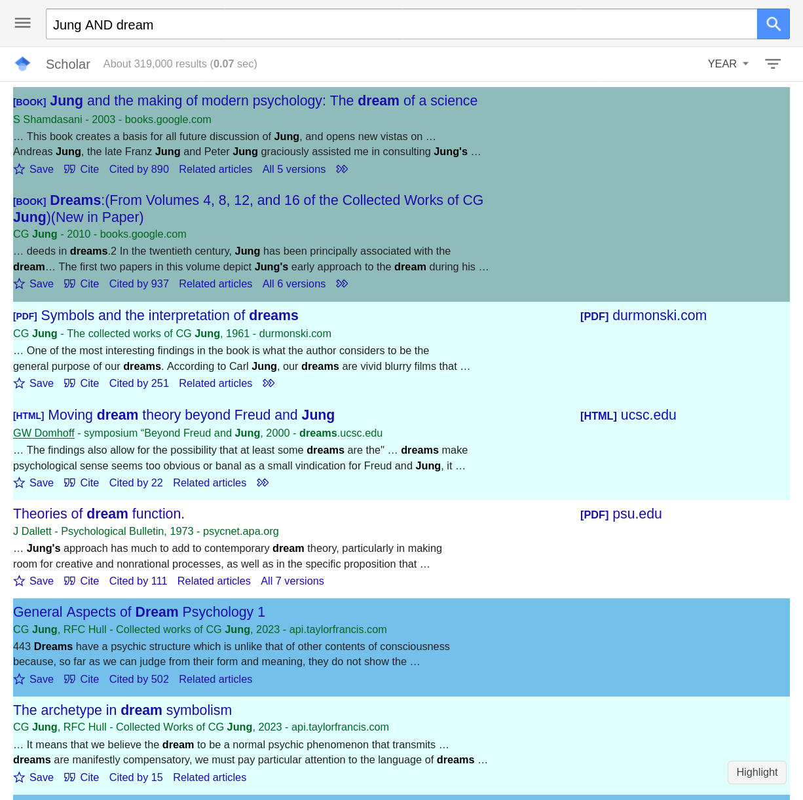

# Google-Scholar-Helper

An user script that adds custom helper functionalities to [https://scholar.google.com](https://scholar.google.com).

## Features

1. Enables managing custom rules for highlighting different search results on Google Scholar.

## Screenshots

## Known Issue

The script might not work when the language of Google Scholar is not set to English. For example, in Chinese/Japanese, `citation: xxx` becomes `被引用数: xxx` and the script won't be able to find the citation number.
